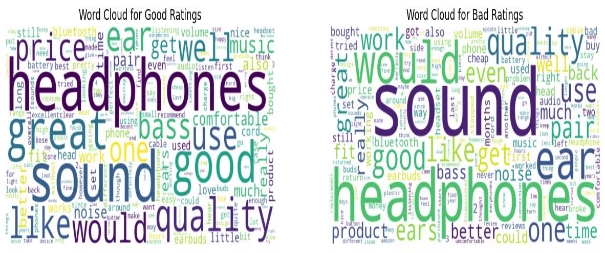
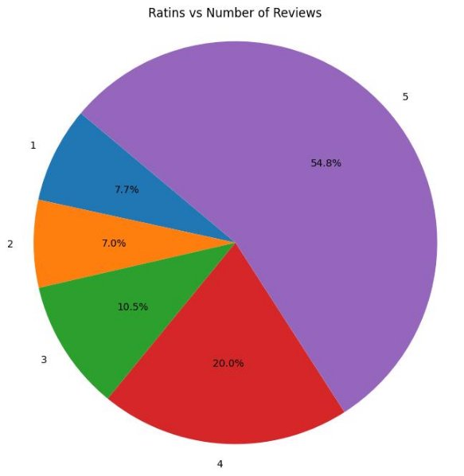

# **Report**

**Product chosen -** Headphones

**Total Number of rows for the product -**

- 1. Removed redundant entries from the review dataset.
- 2. Eliminated duplicate entries from the meta dataset.
- 3. Excluded entries with missing Amazon IDs ('asin') from both datasets.
- 4. Combined both datasets through an inner join operation on the 'asin' column.

Number of rows for the product - 256176

**Descriptive Statistics for the product -**

Number of Reviews: 256176

Average Rating Score: 4.071931016176379 Number of Unique Products: 5279

Number of Good Ratings: 218474

Number of Bad Ratings: 37702

Number of Reviews for each rating: Rating 1: 19683

Rating 2: 18019

Rating 3: 26877

Rating 4: 51206

Rating 5: 140391

**Preprocess the Text-**

- **Function remove\_html\_tags(text):** This function employs regular expressions to strip HTML tags from the provided text.
- pd.isna(text): Verifies whether the input text constitutes a NaN (null) value.
- re.compile('<.\*?>'): Constructs a compiled regular expression pattern designed to detect HTML tags.
- re.sub(clean, '', text): Utilizes re.sub() to replace all occurrences of the pattern (HTML tags) with an empty string, effectively eradicating them from the text.
- **Function remove\_accented\_chars(text):** This function eliminates accented characters present in the supplied text.
- unidecode(text): Utilizes the unidecode library to remove accents and other diacritical marks from the text.
- **Function expand\_acronyms(text):** This function expands contractions within the given text (e.g., "don't" transformed to "do not").
- contractions.fix(text): Utilizes the contractions library to expand contractions within the text.
- **Function lemmatize\_text(text):** This function applies lemmatization to the text, converting words to their base or dictionary forms.
- nlp(text): Tokenizes the text and performs part-of-speech tagging and dependency parsing using spaCy.
- token.lemma\_: Retrieves the lemma (base form) of each token.
- ' '.join(...): Concatenates the lemmatized tokens back into a string.
- **Function remove\_stopwords(text):** This function eliminates stopwords (e.g., "the", "is", etc.) from the given text.
- word\_tokenize(text): Segments the text into individual words.
- [word for word in tokens if word.lower() not in stop\_words]: Filters out stopwords from the tokens, converting each word to lowercase before comparison.
- ' '.join(filtered\_tokens): Merges the filtered tokens back into text after removing stopwords.

  **Exploratory Data Analysis**

  Top 20 most reviewed brands:

- Sony 21200
- Sennheiser 14340
- Bose 8286
- Audio-Technica 6438
- Bluedio 4934
- Mpow 4907
- Panasonic 4888
- Etre Jeune 4683
- Philips 4658
- Symphonized 4285
- MEE audio 4087
- TaoTronics 4079
- Koss 3845
- Plantronics 3602
- JVC 3521
- Toysdone 3506
- JLAB 3164
- SoundPEATS 2778
- EldHus 2725
- Photive 2495

Last 20 reviewed brands:

- Honda 1
- AIRDRIVES 3
- NOIZY Brands 3
- DetectorPro 4
- PopClik 4
- Targus 5
- American Audio 5
- Innovage 5
- TVTimedirect 5
- Amplivox 5
- ZOpid 5
- Rockford Fosgate 5
- Cyber-Blue 5
- SpongeBob SquarePants 5
- Asus 5
- Dr. Mercola 5
- American DJ Supply 5
- Comfort Audio 5
- Gear4 5
- Tt eSPORTS 5

Headphones with the highest average rating: AKG K52 Headphones **Word cloud -**

Most commonly used words for positive reviews:

[('headphones', 171390), ('sound', 168004), ('good', 107122), ('great', 103277), ('quality', 80811), ('ear', 69274), ('like', 68344), ('use', 66218), ('would', 63183), ('well', 55910)]

Most commonly used words for negative reviews:

[('sound', 24335), ('headphones', 23459), ('would', 13700), ('ear', 13141), ('quality', 12654), ('good', 11802), ('one', 10508), ('like', 9993), ('use', 9919), ('get', 8669)]

Pie chart for ratings vs number of reviews-

Year with highest customers - 2016

**Generate review embeddings -**

Used word2vec to generate embeddings for the text.

**ML Model Results-**

**Model: Logistic Regression**

precision recall f1-score support

Bad 0.57 0.53 0.55 6634 Average 0.73 0.80 0.76 9517 Good 0.75 0.69 0.72 4782

accuracy 0.69 20933 macro avg 0.68 0.67 0.68 20933 weighted avg 0.68 0.69 0.69 20933

**Model: Decision Tree**

precision recall f1-score support

Bad 0.44 0.44 0.44 6634 Average 0.64 0.66 0.65 9517 Good 0.51 0.49 0.50 4782

accuracy 0.55 20933 macro avg 0.53 0.53 0.53 20933 weighted avg 0.55 0.55 0.55 20933

**Model: Multinomial Naive Bayes**

precision recall f1-score support

Bad 0.51 0.20 0.28 6634 Average 0.52 0.97 0.68 9517 Good 0.91 0.13 0.22 4782

accuracy 0.53 20933 macro avg 0.65 0.43 0.39 20933 weighted avg 0.61 0.53 0.45 20933

**Model: Gradient Boosting**

precision recall f1-score support

Bad 0.54 0.42 0.48 6634 Average 0.63 0.83 0.72 9517 Good 0.70 0.47 0.56 4782

accuracy 0.62 20933 macro avg 0.63 0.58 0.59 20933 weighted avg 0.62 0.62 0.61 20933

**Model: K nearest neighbors**

precision recall f1-score support

Bad 0.34 0.90 0.50 6634 Average 0.67 0.18 0.29 9517 Good 0.76 0.13 0.23 4782

accuracy 0.40 20933 macro avg 0.59 0.41 0.34 20933 weighted avg 0.59 0.40 0.34 20933

**Top 10 products by user sum ratings:**

1. B003L1ZYYW AmazonBasics High-Speed HDMI Cable - 9.8 Feet (3 Meters) Supports Ethernet, 3D, 4K and Audio Return 41258
1. B0019HL8Q8 Mediabridge HDMI Cable (10 Feet) Supports 4K@60Hz, High Speed, Hand-Tested, HDMI 2.0 Ready - UHD, 18Gbps, Audio Return Channel 38880
1. B0019EHU8G Mediabridge HDMI Cable (6 Feet) Supports 4K@60Hz, High Speed, Hand-Tested, HDMI 2.0 Ready - UHD, 18Gbps, Audio Return Channel 36374
1. B00M55C0NS SanDisk Ultra 32GB UHS-I/Class 10 Micro SDHC Memory Card With Adapter - SDSDQUAN-032G-G4A 29391
1. B000BQ7GW8 SanDisk 2GB Class 4 SD Flash Memory Card- SDSDB-002G-B35 (Label May Change) 28209
1. B00DIF2BO2 Cheetah Mounts APFMSB TV Wall Mount Bracket for 20-55&rdquo; TVs Up To VESA 400 and 115 lbs including a Twisted Veins 10&rsquo; HDMI Cable and a 6&quot; 3-Axis Magnetic Bubble Level 27846
1. B00BWF5U0M Sabrent 4-Port USB 2.0 Hub with Individual Power Switches and LEDs (HB-UMLS) 27802
8. B00IVPU7AO Samsung EVO 64GB 48/MB/s Micro SDXC Memory Card with Adapter up to (MB-MP64DA/AM) 26694
8. B0043T7FXE Logitech M570 Wireless Trackball Mouse &ndash; Ergonomic Design with Sculpted Right-hand Shape, Compatible with Apple Mac and Microsoft Windows Computers, USB Unifying Receiver, Dark Gray 24424
8. B000HPV3RW Belkin 8-Outlet Power Strip Surge Protector with 6-Foot Power Cord and Telephone Protection, BE108200-06 23956
